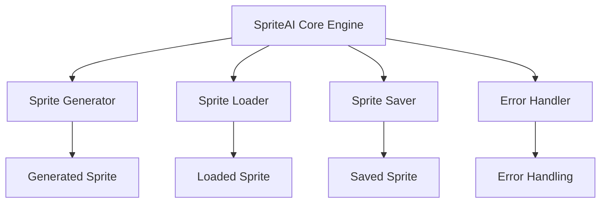
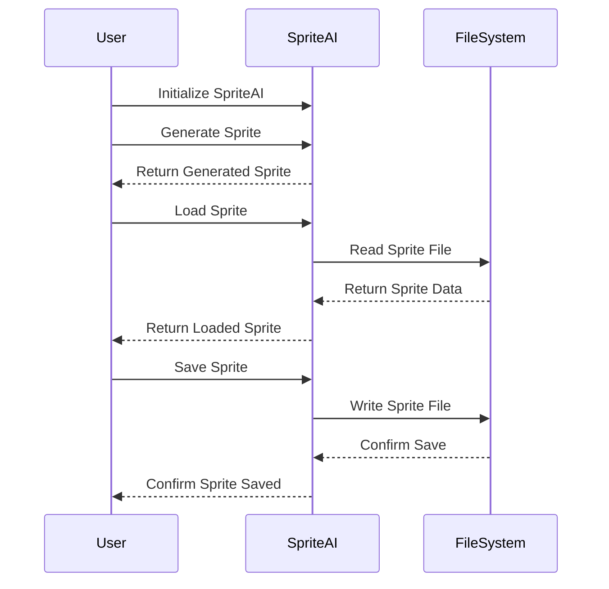

# SpriteAI System Architecture Overview

## Introduction

This document provides an overview of the SpriteAI system architecture, including its main components, data flow, and key features. SpriteAI is a powerful npm package designed for sprite generation, manipulation, and management in JavaScript applications.

## System Components

SpriteAI consists of the following main components:

1. SpriteAI Core Engine
2. Sprite Generator
3. Sprite Loader
4. Sprite Saver
5. Error Handler



### SpriteAI Core Engine

The core engine serves as the central component of the SpriteAI system, coordinating the activities of other components and providing the main interface for developers.

### Sprite Generator

Responsible for programmatically creating new sprites based on specified parameters such as name, width, and height.

### Sprite Loader

Handles the loading of existing sprites from file systems, enabling developers to work with pre-existing sprite assets.

### Sprite Saver

Manages the process of saving sprites to the file system, ensuring that generated or modified sprites can be persisted for future use.

### Error Handler

Provides robust error handling capabilities, particularly important for managing issues that may arise during large file uploads or other sprite operations.

## Data Flow



## Key Features

1. **Sprite Generation**: Create sprites programmatically with custom dimensions.
2. **Sprite Loading**: Load existing sprites from the file system.
3. **Sprite Saving**: Save generated or modified sprites to the file system.
4. **Error Handling**: Robust error management, particularly for large file uploads.

## Error Handling Architecture

SpriteAI implements a comprehensive error handling system, especially crucial for managing large file uploads. The system uses custom error types to provide detailed information about specific issues:

- FileSizeError
- NetworkError
- TimeoutError

```mermaid
classDiagram
    class Error
    class FileSizeError
    class NetworkError
    class TimeoutError

    Error