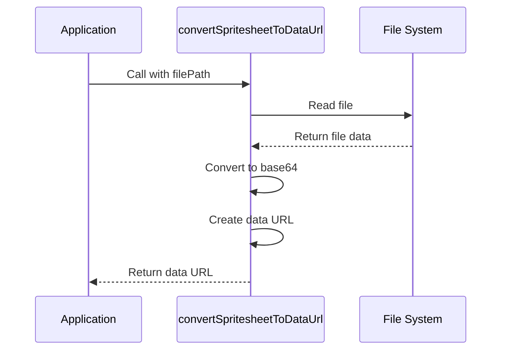

# convertSpritesheetToDataUrl

## Brief Description

`convertSpritesheetToDataUrl` is a utility function that converts a spritesheet image file to a base64-encoded data URL. This function is particularly useful when you need to embed spritesheet images directly in your HTML or JavaScript code without requiring separate image file requests.

## Usage

To use `convertSpritesheetToDataUrl`, import it from the module where it's defined and call it with the path to your spritesheet image file:

```javascript
import { convertSpritesheetToDataUrl } from './path/to/module';

const dataUrl = await convertSpritesheetToDataUrl('./path/to/spritesheet.png');
```

## Parameters

- `filePath` (string, required): The file path to the spritesheet image that you want to convert to a data URL.

## Return Value

Returns a Promise that resolves to a string containing the base64-encoded data URL representation of the spritesheet image.

## Examples

### Basic Usage

```javascript
const spritesheetPath = './assets/character_spritesheet.png';
try {
  const dataUrl = await convertSpritesheetToDataUrl(spritesheetPath);
  console.log(dataUrl);
  // Output: data:image/png;base64,iVBORw0KGgoAAAANSUhEUgAA...
} catch (error) {
  console.error('Error converting spritesheet:', error);
}
```

### Using the Data URL in HTML

```javascript
const spritesheetPath = './assets/item_spritesheet.png';
const dataUrl = await convertSpritesheetToDataUrl(spritesheetPath);
const imgElement = ``;
document.body.innerHTML += imgElement;
```

## Implementation Details

The `convertSpritesheetToDataUrl` function works as follows:

1. It reads the specified image file using the `fs.readFile` method.
2. The file content is converted to a base64-encoded string.
3. The base64 string is then prefixed with the appropriate MIME type to create a valid data URL.

Here's a simplified version of the implementation:

```javascript
import fs from 'fs';

export const convertSpritesheetToDataUrl = (filePath) => {
  return new Promise((resolve, reject) => {
    fs.readFile(filePath, (err, data) => {
      if (err) {
        reject(err);
      } else {
        const base64 = Buffer.from(data).toString('base64');
        const dataUrl = `data:image/png;base64,${base64}`;
        resolve(dataUrl);
      }
    });
  });
};
```

## Notes and Considerations

- Ensure that the file path provided to `convertSpritesheetToDataUrl` is correct and the file exists.
- The function assumes that the input file is a PNG image. If you need to support other image formats, you may need to modify the MIME type in the data URL prefix.
- Data URLs can be significantly larger than the original file size, so be mindful when working with large spritesheets.
- This function uses asynchronous file reading, which is suitable for most use cases. However, for very large files or high-performance scenarios, you might consider using streaming or synchronous alternatives.
- When using the resulting data URL in your application, be aware of any size limitations in the environments where you'll be deploying (e.g., some browsers have limits on the size of data URLs they can handle).



By using `convertSpritesheetToDataUrl`, you can easily integrate spritesheets into your web applications without the need for separate image file requests, potentially improving load times and simplifying asset management.