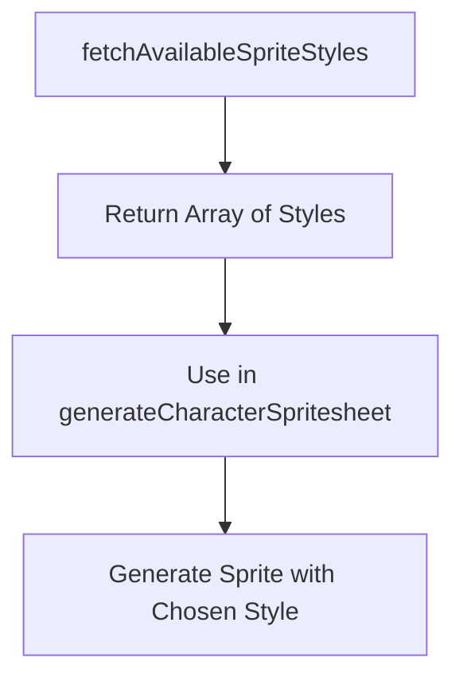

# fetchAvailableSpriteStyles

## Brief Description

The `fetchAvailableSpriteStyles` function is an asynchronous SDK function that retrieves a list of available sprite styles for use in sprite generation.

## Usage

To use `fetchAvailableSpriteStyles`, import it from the sprite module and call it as an asynchronous function.

```javascript
import { fetchAvailableSpriteStyles } from './path/to/sprite/module';

const styles = await fetchAvailableSpriteStyles();
```

## Parameters

This function does not take any parameters.

## Return Value

Returns a Promise that resolves to an array of strings, where each string represents an available sprite style.

## Examples

### Basic Usage

```javascript
import { fetchAvailableSpriteStyles } from './path/to/sprite/module';

async function displayAvailableStyles() {
  try {
    const styles = await fetchAvailableSpriteStyles();
    console.log('Available sprite styles:', styles);
  } catch (error) {
    console.error('Error fetching sprite styles:', error);
  }
}

displayAvailableStyles();
```

### Using with Sprite Generation

```javascript
import { fetchAvailableSpriteStyles, generateCharacterSpritesheet } from './path/to/sprite/module';

async function generateRandomStyleSprite(description) {
  const styles = await fetchAvailableSpriteStyles();
  const randomStyle = styles[Math.floor(Math.random() * styles.length)];
  
  const sprite = await generateCharacterSpritesheet(description, { style: randomStyle });
  return sprite;
}

// Usage
const randomSprite = await generateRandomStyleSprite('A cute robot');
```

## Available Styles

The current implementation returns the following sprite styles:

```javascript
['pixel-art', 'vector', '3d', 'hand-drawn', 'anime']
```

This list may be expanded in future updates to include more style options.

## Notes and Considerations

- The function is asynchronous and returns a Promise, so it should be used with `await` or `.then()`.
- The list of available styles is hardcoded in the current implementation. Future versions may fetch this list from a server or configuration file.
- When using the returned styles with `generateCharacterSpritesheet` or other sprite generation functions, ensure that the chosen style is supported by the AI image generation model (DALL-E 3 in the current implementation).
- The function does not validate or filter the styles based on any criteria. It simply returns all available options.

## Related Functions

- `generateCharacterSpritesheet`: Uses the sprite styles to generate character spritesheets.
- `fetchAvailableAnimationStates`: Retrieves available animation states for sprite generation.



By using `fetchAvailableSpriteStyles`, developers can dynamically access and utilize various sprite styles in their applications, enhancing the flexibility and customization options for sprite generation.