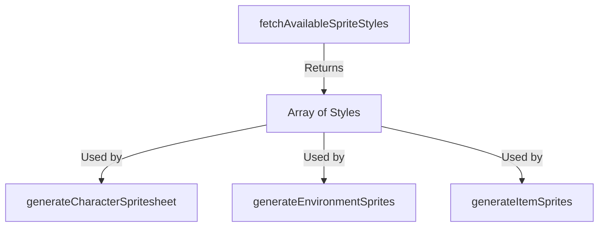

# fetchAvailableSpriteStyles

## Brief Description

`fetchAvailableSpriteStyles` is a function that retrieves an array of available sprite styles that can be used when generating character sprites or environment assets.

## Usage

To use `fetchAvailableSpriteStyles`, import it from the sprite module and call it as an asynchronous function.

```javascript
import { fetchAvailableSpriteStyles } from './path/to/sprite/module';

const styles = await fetchAvailableSpriteStyles();
```

## Parameters

This function does not take any parameters.

## Return Value

Returns a Promise that resolves to an array of strings, where each string represents an available sprite style.

```javascript
['pixel-art', 'vector', '3d', 'hand-drawn', 'anime']
```

## Examples

### Basic Usage

```javascript
import { fetchAvailableSpriteStyles } from './spriteAI';

async function displayAvailableStyles() {
  try {
    const styles = await fetchAvailableSpriteStyles();
    console.log('Available sprite styles:', styles);
  } catch (error) {
    console.error('Error fetching sprite styles:', error);
  }
}

displayAvailableStyles();
```

### Using with Sprite Generation

```javascript
import { generateCharacterSpritesheet, fetchAvailableSpriteStyles } from './spriteAI';

async function generateCustomSprite(description) {
  const styles = await fetchAvailableSpriteStyles();
  const randomStyle = styles[Math.floor(Math.random() * styles.length)];
  
  const sprite = await generateCharacterSpritesheet(description, {
    style: randomStyle,
  });
  
  console.log(`Generated sprite in ${randomStyle} style:`, sprite);
}

generateCustomSprite('A brave knight with shining armor');
```

## Notes or Considerations

- The available styles may be subject to change in future updates. Always check the returned array for the most up-to-date list of styles.
- When using these styles with sprite generation functions, ensure that the chosen style is compatible with the specific generation function you're using.
- The function is asynchronous and returns a Promise. Make sure to use `await` or `.then()` when calling it.

## Related Functions

- `generateCharacterSpritesheet`: Generates a character spritesheet using a specified style.
- `generateEnvironmentSprites`: Creates environment sprites with a chosen style.
- `generateItemSprites`: Produces item sprites in a selected style.



This function is part of the sprite generation module, which allows for flexible and customizable creation of game assets using AI-powered image generation.