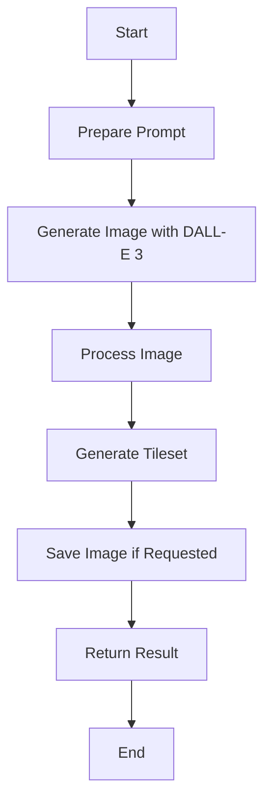

# generateEnvironmentSprites

## Brief Description

`generateEnvironmentSprites` is a function that creates a tileset of environment sprites based on a given description, using AI-powered image generation. This function is particularly useful for generating game environments or background elements quickly and efficiently.

## Usage

To use `generateEnvironmentSprites`, import it from the spriteAI module and call it with a description of the environment you want to generate.

```javascript
import { generateEnvironmentSprites } from './path/to/spriteAI';

const result = await generateEnvironmentSprites(description, options);
```

## Parameters

- `description` (string, required): A text description of the environment to generate.
- `options` (object, optional):
  - `elements` (number): Number of distinct environment pieces to generate (default: 4).
  - `size` (string): Size of the generated image (default: "1024x1024").
  - `style` (string): Art style of the sprites (default: "pixel-art").
  - `padding` (number): Padding between sprite elements (default: 1).
  - `theme` (string): Theme of the environment (default: "fantasy").
  - `save` (boolean): Whether to save the generated image to disk.

## Return Value

Returns a Promise that resolves to an object containing:

- `original` (string): URL of the original generated image.
- `tileset` (string): Base64-encoded image data URL of the processed tileset.
- `metadata` (object): Information about the generated tileset, including:
  - `elements` (number): Number of distinct environment pieces.
  - `theme` (string): Theme of the environment.
  - `dimensions` (object): Width and height of the generated image.
  - `tileData` (object): Information about the tileset layout.

## Examples

### 1. Generate a basic forest environment tileset

```javascript
const result = await generateEnvironmentSprites("A lush forest with trees, bushes, and rocks");
console.log(result.tileset);
console.log(result.metadata);
```

### 2. Generate a sci-fi environment with custom options

```javascript
const options = {
  elements: 6,
  size: "2048x2048",
  style: "vector",
  theme: "sci-fi",
  save: true
};

const result = await generateEnvironmentSprites("A futuristic space station interior", options);
console.log(result.metadata.tileData);
```

## Notes and Considerations

- The function uses the DALL-E 3 AI model to generate images, which may result in varying outputs for the same input.
- Generated tilesets are optimized for game environments and follow a specific layout (grid of elements).
- When saving images, they are stored in an 'assets' folder with a filename based on the description.
- The function may take some time to complete due to API calls and image processing.
- Consider using the `fetchAvailableSpriteStyles` function to get a list of available sprite styles.

## Workflow Diagram

Here's a simplified workflow of how the `generateEnvironmentSprites` function operates:



## Related Functions

- `fetchAvailableSpriteStyles`: Retrieves a list of available sprite styles.
- `generateItemSprites`: Generates a set of item sprites based on a given description.
- `generateSprite`: Generates a character sprite sheet based on a given description.

This function enhances the capabilities of the spriteAI module by allowing developers to quickly generate environment assets for their games or applications, complementing the existing character sprite generation functionality.