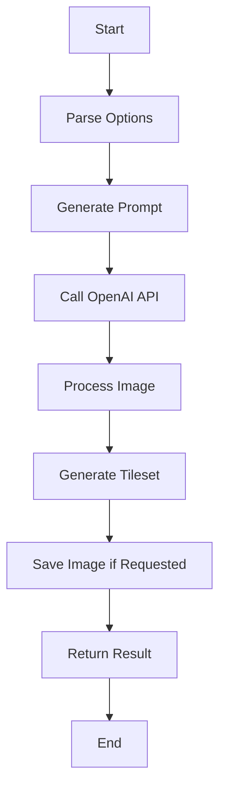

# generateEnvironmentSprites

## Brief Description

`generateEnvironmentSprites` is a function that generates a tileset of environment sprites based on a given description, using AI-powered image generation. This function is particularly useful for creating game environments and backgrounds.

## Usage

To use `generateEnvironmentSprites`, import it from the sprite module and call it with a description of the environment you want to generate.

```javascript
import { generateEnvironmentSprites } from './path/to/sprite/module';

const result = await generateEnvironmentSprites(description, options);
```

## Parameters

- `description` (string, required): A text description of the environment to generate.
- `options` (object, optional):
  - `elements` (number): Number of distinct environment pieces to generate (default: 4).
  - `size` (string): Size of the generated image (default: "1024x1024").
  - `style` (string): The art style of the sprites (default: "pixel-art").
  - `padding` (number): Padding between sprites (default: 1).
  - `theme` (string): The theme of the environment (default: "fantasy").
  - `save` (boolean): Whether to save the generated image to disk.

## Return Value

Returns a Promise that resolves to an object containing:

- `original`: URL of the original generated image.
- `tileset`: Base64-encoded image data URL of the processed tileset.
- `metadata`: Object containing information about the generated tileset:
  - `elements`: Number of distinct environment pieces.
  - `theme`: The theme of the environment.
  - `dimensions`: Object with width and height of the generated image.
  - `tileData`: Object with information about the tileset layout.

## Examples

1. Generate a basic environment tileset:

```javascript
const result = await generateEnvironmentSprites("A lush forest with ancient ruins");
console.log(result.metadata);
console.log(result.tileset);
```

2. Generate a custom environment tileset with specific options:

```javascript
const options = {
  elements: 6,
  size: "2048x2048",
  style: "vector",
  theme: "sci-fi",
  save: true
};

const result = await generateEnvironmentSprites("A futuristic space station interior", options);
console.log(result.metadata);
```

## Process Flow

The following diagram illustrates the process flow of the `generateEnvironmentSprites` function:



## Notes and Considerations

- The function uses the DALL-E 3 model to generate images, which may result in varying outputs for the same input.
- Generated tilesets are optimized for game environments and follow a specific layout based on the number of elements.
- The `style` option allows you to specify different art styles like "pixel-art", "vector", "3d", etc.
- When saving images, they are stored in an 'assets' folder with a filename based on the description.
- The function may take some time to complete due to API calls and image processing.
- Ensure you have the necessary permissions and API keys set up for OpenAI image generation.

## Related Functions

- `generateCharacterSpritesheet`: For generating character sprite sheets.
- `generateItemSprites`: For generating item sprites for game inventories.
- `fetchAvailableSpriteStyles`: To get a list of available sprite styles.

By leveraging `generateEnvironmentSprites`, you can quickly create diverse and thematic environment assets for your game or application, saving time in the asset creation process.