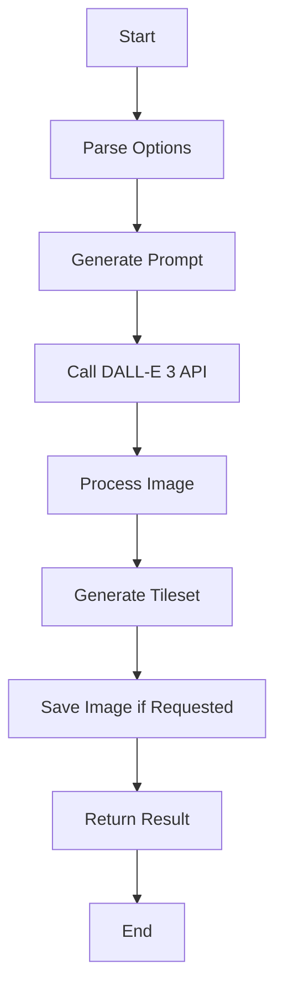

# generateEnvironmentSprites

## Brief Description

The `generateEnvironmentSprites` function is an asynchronous function that generates environment sprites for game development using AI-powered image generation. It creates a tileset of environment elements based on a given description and customizable options.

## Usage

To use `generateEnvironmentSprites`, import it from the sprite module and call it with a description of the environment you want to generate.

```javascript
import { generateEnvironmentSprites } from './path/to/sprite/module';

const result = await generateEnvironmentSprites(description, options);
```

## Parameters

- `description` (string, required): A text description of the environment to generate.
- `options` (object, optional):
  - `elements` (number): Number of distinct environment elements to generate (default: 4).
  - `size` (string): Size of the generated image (default: "1024x1024").
  - `style` (string): Art style of the generated sprites (default: "pixel-art").
  - `padding` (number): Padding between elements in the tileset (default: 1).
  - `theme` (string): Theme of the environment (default: "fantasy").
  - `save` (boolean): Whether to save the generated image to disk.

## Return Value

Returns a Promise that resolves to an object containing:
- `original`: URL of the original generated image.
- `tileset`: Base64-encoded image data URL of the processed tileset.
- `metadata`: Object containing information about the generated tileset.

## Examples

1. Generate a basic environment tileset:

```javascript
const result = await generateEnvironmentSprites("A lush forest with ancient ruins");
console.log(result.metadata);
console.log(result.tileset);
```

2. Generate a custom environment tileset with specific options:

```javascript
const options = {
  elements: 6,
  size: "2048x2048",
  style: "3d",
  theme: "sci-fi",
  save: true
};

const result = await generateEnvironmentSprites("A futuristic space station", options);
console.log(result.metadata);
```

## Metadata Structure

The `metadata` object in the return value contains the following information:

```javascript
{
  elements: number,
  theme: string,
  dimensions: {
    width: string,
    height: string
  },
  tileData: {
    rows: number,
    columns: number,
    totalTiles: number
  }
}
```

## Notes and Considerations

- The function uses the DALL-E 3 AI model to generate images, which may result in varying outputs for the same input.
- Generated tilesets are optimized for game environments and follow a specific layout (grid of elements).
- When saving images, they are stored in an 'assets' folder with a filename based on the description.
- The function may take some time to complete due to API calls and image processing.
- Ensure you have the necessary dependencies installed (OpenAI, axios, sharp) to use this function.

## Flow Diagram



This diagram illustrates the high-level flow of the `generateEnvironmentSprites` function, from parsing options to returning the final result.