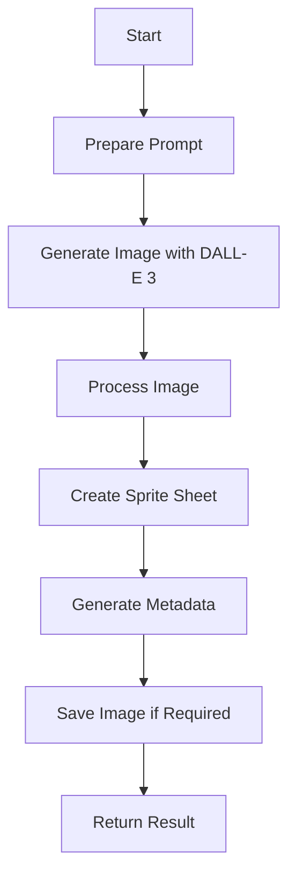

# generateItemSprites

## Brief Description

`generateItemSprites` is a function that generates a collection of item sprites for a game based on a given description, using AI-powered image generation.

## Usage

To use `generateItemSprites`, import it from the sprite module and call it with a description of the items you want to generate.

```javascript
import { generateItemSprites } from './path/to/sprite/module';

const result = await generateItemSprites(description, options);
```

## Parameters

- `description` (string, required): A text description of the items to generate.
- `options` (object, optional):
  - `itemCount` (number): Number of items to generate (default: 4).
  - `size` (string): Size of the generated image (default: "1024x1024").
  - `style` (string): Style of the generated sprites (default: "pixel-art").
  - `padding` (number): Padding between items (default: 1).
  - `itemType` (string): Type of items to generate (default: "equipment").
  - `background` (string): Background color of the sprite sheet (default: "white").
  - `save` (boolean): Whether to save the generated image to disk.

## Return Value

Returns a Promise that resolves to an object containing:

- `original`: URL of the original generated image.
- `itemSheet`: Base64-encoded image data URL of the processed item sprite sheet.
- `metadata`: Object containing information about the generated items:
  - `itemCount`: Number of items generated.
  - `itemType`: Type of items generated.
  - `dimensions`: Object with width and height of the sprite sheet.
  - `itemData`: Object with information about the layout of items in the sheet.

## Examples

1. Generate a basic set of item sprites:

```javascript
const result = await generateItemSprites("Fantasy RPG weapons");
console.log(result.metadata);
console.log(result.itemSheet);
```

2. Generate a custom set of item sprites with specific options:

```javascript
const options = {
  itemCount: 6,
  size: "2048x2048",
  style: "hand-drawn",
  itemType: "potions",
  background: "transparent",
  save: true
};

const result = await generateItemSprites("Magical potion bottles", options);
console.log(result.metadata);
```

## Notes and Considerations

- The function uses the DALL-E 3 AI model to generate images, which may result in varying outputs for the same input.
- Generated sprites are arranged in a grid layout, with a maximum of 2 columns.
- The function automatically processes the generated image to create individual sprite cells.
- When saving images, they are stored in an 'assets' folder with a filename based on the description.
- The function may take some time to complete due to API calls and image processing.

## Item Generation Process

The following diagram illustrates the process of generating item sprites:



This process ensures that the generated items are consistent in style and properly formatted for use in game development.