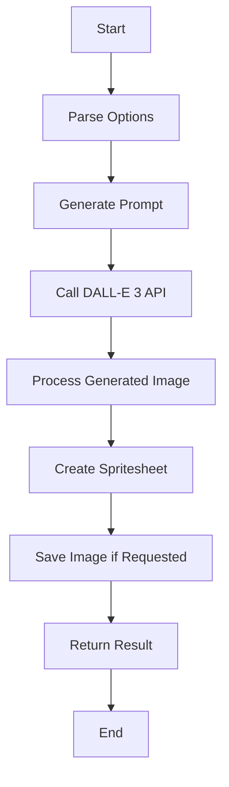

# generateItemSprites

## Brief Description

The `generateItemSprites` function is an asynchronous method that generates a collection of item sprites for game development using AI-powered image generation. It creates a spritesheet containing multiple items based on a given description and customizable options.

## Usage

To use `generateItemSprites`, import it from the sprite module and call it with a description of the items you want to generate.

```javascript
import { generateItemSprites } from './path/to/sprite/module';

const result = await generateItemSprites(description, options);
```

## Parameters

- `description` (string, required): A text description of the items to generate.
- `options` (object, optional):
  - `itemCount` (number): Number of items to generate (default: 4).
  - `size` (string): Size of the generated image (default: "1024x1024").
  - `style` (string): Style of the generated items (default: "pixel-art").
  - `padding` (number): Padding between items in the spritesheet (default: 1).
  - `itemType` (string): Type of items to generate (default: "equipment").
  - `background` (string): Background color of the spritesheet (default: "white").
  - `save` (boolean): Whether to save the generated image to disk.

## Return Value

Returns a Promise that resolves to an object containing:

- `original`: URL of the original generated image.
- `itemSheet`: Base64-encoded image data URL of the generated item spritesheet.
- `metadata`: Object containing information about the generated items:
  - `itemCount`: Number of items generated.
  - `itemType`: Type of items generated.
  - `dimensions`: Width and height of the generated image.
  - `itemData`: Information about the layout of items in the spritesheet.

## Examples

1. Generate a basic item spritesheet:

```javascript
const result = await generateItemSprites("Fantasy RPG weapons");
console.log(result.metadata);
console.log(result.itemSheet);
```

2. Generate a custom item spritesheet with specific options:

```javascript
const options = {
  itemCount: 6,
  size: "2048x2048",
  style: "hand-drawn",
  itemType: "potions",
  background: "transparent",
  save: true
};

const result = await generateItemSprites("Magical potion bottles", options);
console.log(result.metadata);
```

## Notes and Considerations

- The function uses the DALL-E 3 AI model to generate images, which may result in varying outputs for the same input.
- Generated items are arranged in a grid layout, with a maximum of 2 columns.
- The function automatically calculates the number of rows based on the `itemCount`.
- When saving images, they are stored in an 'assets' folder with a filename based on the description.
- The function may take some time to complete due to API calls and image processing.
- Ensure you have the necessary API credentials and dependencies set up for OpenAI and image processing libraries.

## Customization

You can customize the appearance of generated items by adjusting the `options` parameter. For example, to generate a set of sci-fi gadgets with a dark background:

```javascript
const options = {
  itemCount: 8,
  style: "vector",
  itemType: "gadgets",
  background: "black"
};

const result = await generateItemSprites("Futuristic sci-fi gadgets and devices", options);
```

This will create a spritesheet with 8 vector-style sci-fi gadgets on a black background.

## Workflow Diagram



This diagram illustrates the workflow of the `generateItemSprites` function, from parsing options to returning the final result.