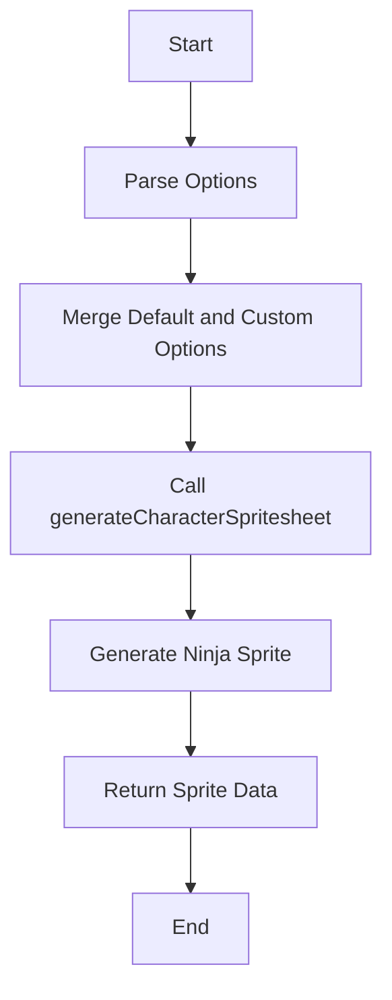

# Generate Ninja

## Overview

The `generateNinja` function is a convenience function for generating a pixel-art spritesheet of a ninja character. It utilizes the `generateCharacterSpritesheet` function to create a customized ninja sprite with predefined animation states.

## Function Signature

```javascript
export const generateNinja = async function(options = {}) {
  // Function implementation
}
```

## Parameters

- `options` (optional): An object containing custom options to override the default settings.

## Default Options

```javascript
const defaultOptions = {
  states: ['idle', 'walk', 'run', 'attack', 'sneak'],
  style: 'pixel-art',
  framesPerState: 6
};
```

- `states`: An array of animation states for the ninja character.
- `style`: The art style of the generated sprite (default is 'pixel-art').
- `framesPerState`: The number of frames for each animation state.

## Usage

```javascript
import { generateNinja } from './path/to/spriteAI';

// Generate a ninja sprite with default options
const ninjaSprite = await generateNinja();

// Generate a ninja sprite with custom options
const customNinjaSprite = await generateNinja({
  states: ['idle', 'walk', 'attack'],
  framesPerState: 8
});
```

## Functionality

1. The function merges the default options with any custom options provided.
2. It then calls the `generateCharacterSpritesheet` function with the following parameters:
   - A description string: 'ninja character with black outfit and mask'
   - The merged options object

## Return Value

The function returns the result of `generateCharacterSpritesheet`, which includes:

- The original image URL
- The base64-encoded spritesheet
- Metadata about the generated sprite, including dimensions, states, and frame data

## Notes

- The generated ninja character will be wearing a black outfit and mask.
- The sprite is designed in a pixel-art style by default.
- The function is asynchronous and returns a Promise, so it should be used with `await` or `.then()`.

## Function Flow



## See Also

- `generateCharacterSpritesheet`: The underlying function used to generate the spritesheet.
- `generateSpaceman`: Similar function for generating spaceman sprites.
- `generateRobot`: Similar function for generating robot sprites.
