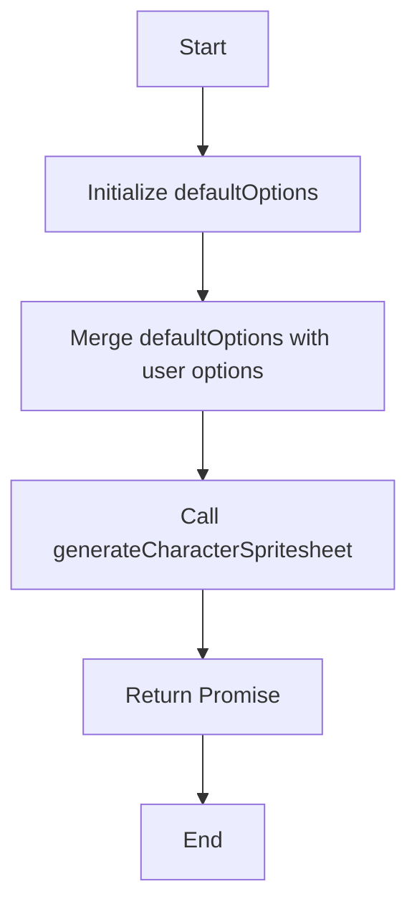

# Generate Spaceman

## Overview

The `generateSpaceman` function is a convenience function for generating a pixel-art character spritesheet of an astronaut. This function is part of the SpriteAI library and utilizes the `generateCharacterSpritesheet` function to create a customizable spaceman character.

## Function Signature

```javascript
export const generateSpaceman = async function(options = {}) {
  // Function implementation
}
```

## Parameters

The `generateSpaceman` function accepts an optional `options` object with the following default values:

```javascript
const defaultOptions = {
  states: ['idle', 'walk', 'run', 'float'],
  style: 'pixel-art',
  framesPerState: 6
};
```

- `states`: An array of animation states for the spaceman character.
- `style`: The art style of the generated spritesheet.
- `framesPerState`: The number of frames for each animation state.

You can override these defaults by passing your own options object.

## Usage

To generate a spaceman character spritesheet, you can call the function like this:

```javascript
const spaceman = await generateSpaceman();
```

Or with custom options:

```javascript
const customSpaceman = await generateSpaceman({
  states: ['idle', 'walk', 'run', 'float', 'jump'],
  framesPerState: 8
});
```

## Return Value

The function returns a promise that resolves to the result of `generateCharacterSpritesheet`. This typically includes:

- The original image URL
- A base64-encoded spritesheet
- Metadata about the generated spritesheet

## Implementation Details

The `generateSpaceman` function creates a merged options object by combining the default options with any user-provided options. It then calls the `generateCharacterSpritesheet` function with a description of an "astronaut character with space suit and helmet" and the merged options.

```javascript
const mergedOptions = { ...defaultOptions, ...options };
return generateCharacterSpritesheet('astronaut character with space suit and helmet', mergedOptions);
```

This approach allows for flexible customization while providing sensible defaults for a spaceman character.

## Function Flow



## Notes

- The generated spaceman character will be in a pixel-art style by default.
- The default animation states include idle, walk, run, and float, which are appropriate for a spaceman character in various game scenarios.
- You can extend or modify the animation states and other options as needed for your specific use case.

For more detailed information about the underlying spritesheet generation process, please refer to the documentation for the `generateCharacterSpritesheet` function.
