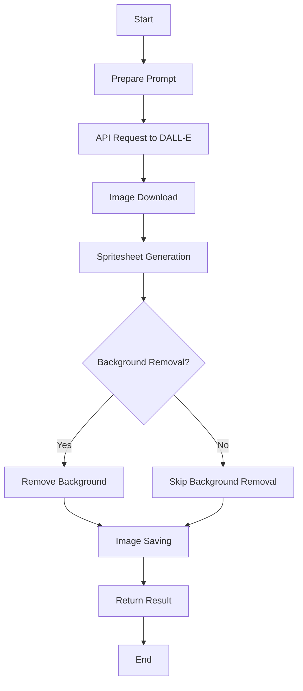

# generateSprite Documentation

## Brief Description
`generateSprite` is a function that generates a sprite sheet image based on a given description, using AI-powered image generation and analysis.

## Usage
To use `generateSprite`, import it from the sprite module and call it with a description of the character you want to generate.

```javascript
import { sprite } from './path/to/sprite/module';

const result = await sprite.generateSprite(description, options);
```

## Parameters
- `description` (string, required): A text description of the character to generate.
- `options` (object, optional):
  - `iterations` (number): Number of sprite variations to generate.
  - `size` (string): Size of the generated image (default: "1024x1024").
  - `save` (boolean): Whether to save the generated image to disk.

## Return Value
Returns an object or array of objects containing:
- `messages`: JSON object with frameHeight and frameWidth information.
- `image`: Base64-encoded image data URL of the generated sprite sheet.

## Process Flow



## Examples

1. Generate a single sprite sheet:
```javascript
const result = await sprite.generateSprite("A pixelated robot");
console.log(result.messages);
console.log(result.image);
```

2. Generate multiple variations:
```javascript
const variations = await sprite.generateSprite("A cartoon cat", { iterations: 3 });
variations.forEach((variation, index) => {
  console.log(`Variation ${index + 1}:`, variation.messages);
});
```

## Notes or Considerations
- The function uses AI models (DALL-E 3 and GPT) to generate and analyze images, which may result in varying outputs for the same input.
- Generated sprites are optimized for walking animations and follow a specific layout (6 frames in a 2x3 grid).
- The function converts images to grayscale, which may affect the final output.
- When saving images, they are stored in an 'assets' folder with a filename based on the description.
- The function may take some time to complete due to API calls and image processing.
