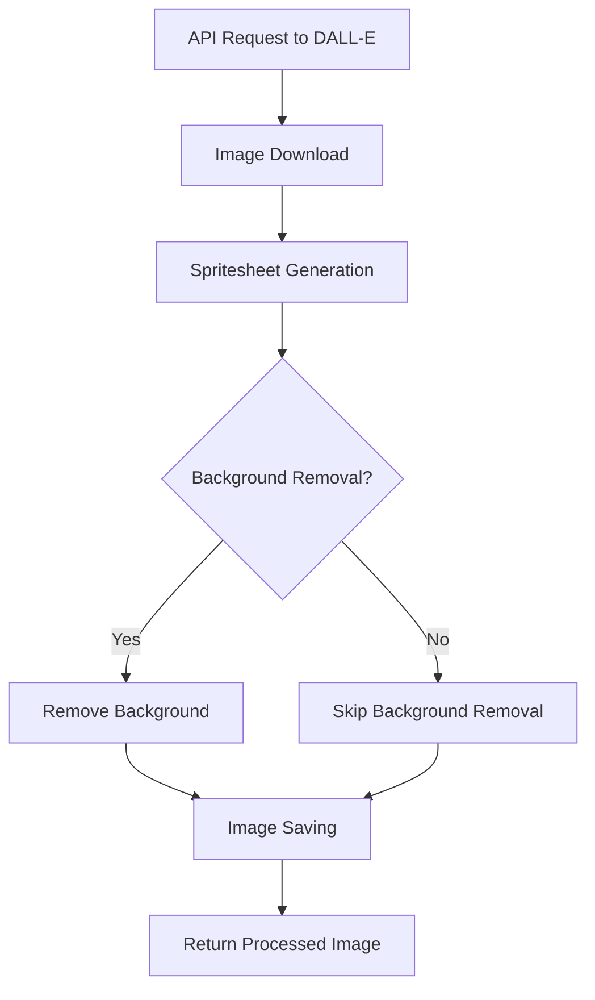

# SpriteAI SDK Quickstart Guide

This guide will help you get started with the SpriteAI SDK, which allows you to generate game assets programmatically using AI.

## Installation

To use the SpriteAI SDK, you need to have Node.js installed on your system. Then, you can install the SDK using npm:

```bash
npm install spriteai
```

## Usage

First, import the necessary functions from the SpriteAI SDK:

```javascript
import { 
  generateCharacterSpritesheet, 
  generateEnvironmentSprites, 
  generateItemSprites, 
  fetchAvailableAnimationStates, 
  fetchAvailableSpriteStyles 
} from 'spriteai';
```

### Generating Character Spritesheets

To generate a character spritesheet:

```javascript
const characterDescription = 'A brave knight in shining armor';
const options = {
  states: ['idle', 'walk', 'run', 'attack'],
  framesPerState: 6,
  size: '1024x1024',
  style: 'pixel-art',
  direction: 'right',
  save: true
};

const result = await generateCharacterSpritesheet(characterDescription, options);
console.log(result.spritesheet); // Base64 encoded PNG
console.log(result.metadata); // Spritesheet metadata
```

### Generating Environment Sprites

To generate environment sprites:

```javascript
const environmentDescription = 'A lush forest with ancient ruins';
const options = {
  elements: 4,
  size: '1024x1024',
  style: 'pixel-art',
  theme: 'fantasy',
  save: true
};

const result = await generateEnvironmentSprites(environmentDescription, options);
console.log(result.tileset); // Base64 encoded PNG
console.log(result.metadata); // Environment tileset metadata
```

### Generating Item Sprites

To generate item sprites:

```javascript
const itemDescription = 'Medieval weapons and armor';
const options = {
  itemCount: 4,
  size: '1024x1024',
  style: 'pixel-art',
  itemType: 'equipment',
  save: true
};

const result = await generateItemSprites(itemDescription, options);
console.log(result.itemSheet); // Base64 encoded PNG
console.log(result.metadata); // Item sheet metadata
```

### Fetching Available Animation States

To get a list of available animation states:

```javascript
const states = await fetchAvailableAnimationStates();
console.log(states); // Array of available animation states
```

### Fetching Available Sprite Styles

To get a list of available sprite styles:

```javascript
const styles = await fetchAvailableSpriteStyles();
console.log(styles); // Array of available sprite styles
```

## Image Processing Pipeline

The following diagram illustrates the image processing pipeline used in the SpriteAI SDK:



## Options

Each generation function accepts an options object that allows you to customize the output. Here are some common options:

- `size`: The size of the generated image (e.g., '1024x1024')
- `style`: The art style of the sprites (e.g., 'pixel-art', 'vector', '3d', 'hand-drawn', 'anime')
- `save`: When set to `true`, saves the generated image to the `assets` folder in your current working directory

Refer to each function's specific options for more details.

## Output

The generation functions return an object containing:

- `originalImageUrl`: The URL of the original image generated by the AI
- `spritesheet` or `tileset` or `itemSheet`: Base64 encoded PNG of the processed assets
- `metadata`: Detailed information about the generated assets, including:
  - `dimensions`: Width and height of the spritesheet/tileset
  - `frameData`: Information about individual frames (for character spritesheets)
  - `tileData`: Information about individual tiles (for environment tilesets)
  - `itemData`: Information about individual items (for item sheets)

## Error Handling

It's important to implement proper error handling when using the SpriteAI SDK. Here's an example:

```javascript
try {
  const result = await generateCharacterSpritesheet(characterDescription, options);
  // Process the result
} catch (error) {
  console.error('Error generating character spritesheet:', error.message);
  // Handle the error appropriately
}
```

## Best Practices

1. **Optimize API Usage**: To reduce costs and improve performance, cache generated assets when possible.
2. **Validate Inputs**: Always validate user inputs before passing them to the SDK functions.
3. **Handle Rate Limits**: Be aware of any rate limits and implement appropriate retry logic.
4. **Asset Management**: Implement a system to manage and organize the generated assets effectively.

## Next Steps

- Explore the different options for each generation function to customize your output
- Integrate the generated assets into your game development workflow
- Check out the full API documentation for more advanced usage and features
- Join our community forum to share your creations and get support

Happy sprite generating!
