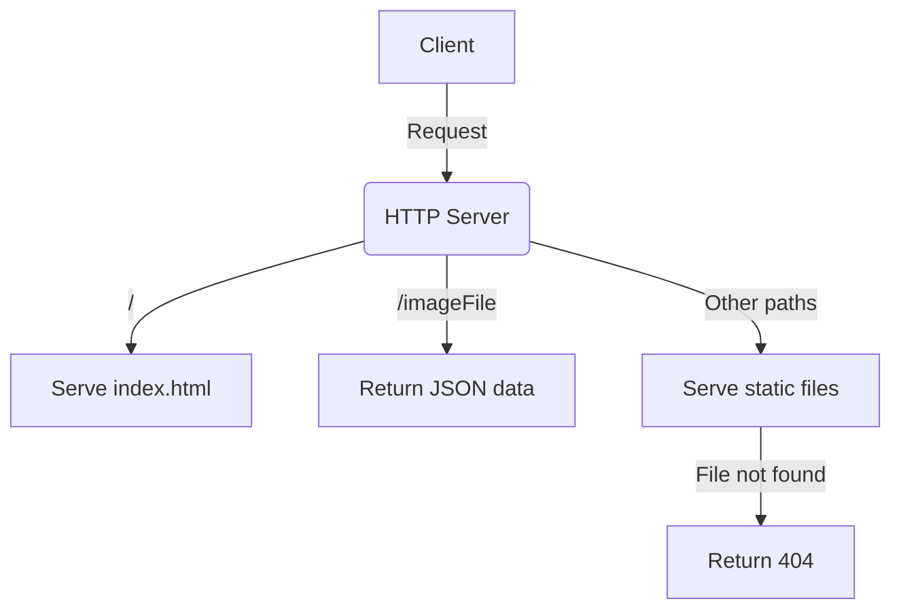

# startServer Documentation

## Brief Description

The `startServer` function is responsible for creating and starting an HTTP server that serves static files and provides information about the generated sprite image. This server is crucial for displaying and interacting with the generated sprite animations.

## Usage

To use the `startServer` function, import it from the module where it's defined and call it with the desired parameters.

```javascript
import { startServer } from './path/to/module';

startServer(3000, 'sprite.png', 12);
```

## Parameters

- `port` (number, optional): The port number on which the server will listen. Default is 3000.
- `imageFile` (string, optional): The filename of the sprite image to be served. Default is 'sprite.png'.
- `frameCount` (number, optional): The number of frames in the sprite animation. Default is 12.

## Return Value

The function doesn't return a value, but it starts an HTTP server and logs a message to the console when the server is running.

## Functionality

The `startServer` function performs the following tasks:

1. Creates an HTTP server using `http.createServer()`.
2. Handles incoming requests and serves appropriate content based on the request URL.
3. Serves static files (HTML, JavaScript, CSS, images) from the current directory.
4. Provides a special endpoint `/imageFile` that returns JSON data about the sprite image and frame count.
5. Handles 404 errors for files not found.
6. Starts listening on the specified port.

## Example

```javascript
import { startServer } from './server';

// Start the server on port 3000 with default image file and frame count
startServer();

// Start the server on port 8080 with a custom image file and frame count
startServer(8080, 'custom-sprite.png', 8);
```

## Server Endpoints

1. `/`: Serves the `index.html` file.
2. `/imageFile`: Returns JSON data containing the `imageFile` name and `frameCount`.
3. Other paths: Attempts to serve static files from the current directory.



## Notes and Considerations

- The server uses the `fs` module to read files synchronously. For production environments with high traffic, consider using asynchronous file reading or a more robust static file serving solution.
- The server currently doesn't handle HTTPS. If secure connections are required, additional configuration would be needed.
- The MIME types for served files are limited to common web file types. If you need to serve additional file types, you may need to extend the `mimeTypes` object.
- Error handling is basic. In a production environment, you might want to implement more comprehensive error logging and handling.
- The server is designed to work in conjunction with the `generateSprite` function and the provided `index.html` file, which uses Phaser for sprite animation.

By using the `startServer` function, you can quickly set up a development server to test and showcase the sprite animations generated by the `generateSprite` function.